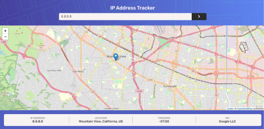

# IP address tracker

In this project, you can check where an IP address is just by typing in the IP or domain numbers. It will display data on a map.

## Preview 🖼

## Demo 💻

If you want to see the demo, you can visit this link. **[Demo of the project](https://mxrold.github.io/frontend-mentor-ip-address-tracker/public/)**

## Pre requirements 📋

To run this project or you want to modify something, you needed the next points:
- A code editor as Visual Studio Code, Atom, Sublime Text, among others.
- Have Git installed.

## Installation - How to clone 🚀

To install and run this project you can to do with __git clone__

- With HTTPS
~~~
https://github.com/mxrold/frontend-mentor-ip-address-tracker.git
~~~
- With SSH
~~~
git@github.com:mxrold/frontend-mentor-ip-address-tracker.git
~~~

_Not sure how to clone a project? **[Check this](https://github.com/mxrold/how-to-clone-a-repository-in-github/blob/main/README.md)**_

## Building with 🛠️

- HTML
- CSS
- JavaScript
- API [Leafletjs](https://leafletjs.com/)
